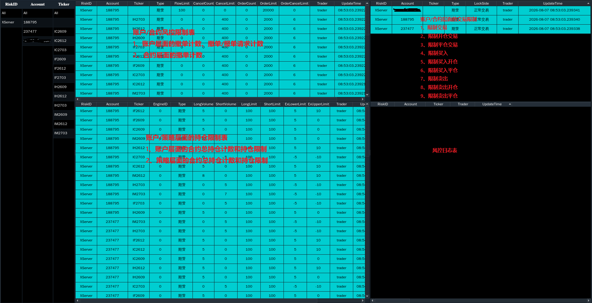

### XRiskJudge
- 风控系统，主要功能如下：
  - 提供账户间风控，如流速控制、账户锁定、自成交、撤单限制检查等风控功能；
  - 加载风控参数，解析XServer转发的风控控制命令，更新风控参数，发送风控参数至XWatcher；
  - 接收XTrader报单、撤单请求，进行风控检查，发送风控检查结果至XTrader；
  - 接收XTrader报单回报、撤单回报，管理订单状态，Ticker交易日内累计撤单计数。
  - 使用SHMServer作为风控服务端，降低时延。

- 风控系统提供程序化交易报备合规风控要求，包括流速限制，账户/合约锁定和恢复交易，交易指令检查(合约有效性、价格、数量)，防自成交，Ticker撤单限制、订单撤单限制、订单申报次数限制，策略层面合约持仓限制，账户层面合约持仓限制和净持仓限制；双击XMonitor客户端的RiskJudge插件页的对应表格行可修改风控限制参数。如下：

- 注：**对于删除操作，XMonitor客户端则在XServer删除相应二进制快照Bin文件后重启生效，生产环境通常为次日生效**。